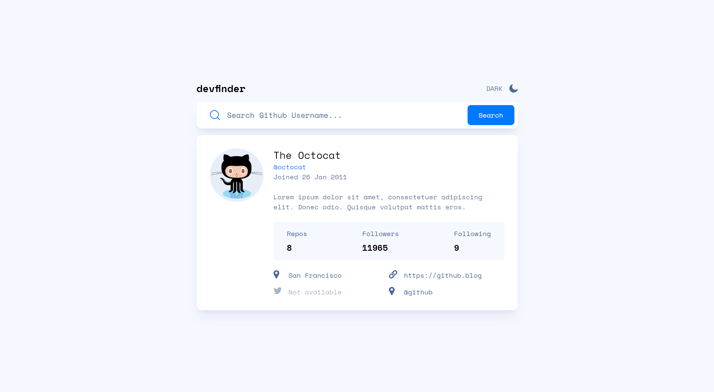

# Frontend Mentor - GitHub user search app solution

This is a solution to the [GitHub user search app challenge on Frontend Mentor](https://www.frontendmentor.io/challenges/github-user-search-app-Q09YOgaH6). Frontend Mentor challenges help you improve your coding skills by building realistic projects.

## Table of contents

- [Overview](#overview)
  - [The challenge](#the-challenge)
  - [Screenshot](#screenshot)
  - [Links](#links)
- [My process](#my-process)
  - [Built with](#built-with)
  - [What I learned](#what-i-learned)
- [Author](#author)

**Note: Delete this note and update the table of contents based on what sections you keep.**

## Overview

### The challenge

Users should be able to:

- View the optimal layout for the app depending on their device's screen size
- See hover states for all interactive elements on the page
- Search for GitHub users by their username
- See relevant user information based on their search
- Switch between light and dark themes
- **Bonus**: Have the correct color scheme chosen for them based on their computer preferences. _Hint_: Research `prefers-color-scheme` in CSS.

### Screenshot



### Links

- Solution URL: [https://github.com/KH-Ray/github-user-search-app](https://github.com/KH-Ray/github-user-search-app)
- Live Site URL: [https://delightful-frangipane-6eb1ff.netlify.app/](https://delightful-frangipane-6eb1ff.netlify.app/)

## My process

### Built with

- Semantic HTML5 markup
- CSS custom properties
- Flexbox
- CSS Grid
- [React](https://reactjs.org/) - JS library
- [tailwindcss](https://tailwindcss.com/) - A utility-first CSS framework
- [Typescript](https://www.typescriptlang.org/) - A free and open-source high-level programming language

### What I learned

```js
const App = (): JSX.Element => {
  const [darkMode, setDarkMode] = useState(false);
  const [searchUsername, setSearchUsername] = useState("octocat");
  const [fecthUsername, setFetchUsername] = useState<GithubAccount>({
    avatar_url: "",
    name: "",
    login: "",
    created_at: "",
    bio: "",
    public_repos: 0,
    followers: 0,
    following: 0,
    location: "",
    blog: "",
    twitter_username: "",
    company: "",
  });
  const [fetchAPI, setFetchAPI] = useState(false);
  const [errorMsg, setErrorMsg] = useState("");
  const [isLoading, setIsLoading] = useState(false);

  useEffect(() => {
    setIsLoading(true);

    getGithubAccount(searchUsername)
      .then((data) => {
        setFetchUsername(data);
        setIsLoading(false);
      })
      .catch(() => {
        setErrorMsg("No results");
        setIsLoading(false);
        setTimeout(() => {
          setErrorMsg("");
        }, 10000);
      });

    setFetchAPI(false);
    // eslint-disable-next-line react-hooks/exhaustive-deps
  }, [fetchAPI]);

  const inputDate = new Date(fecthUsername.created_at);
  const options: Intl.DateTimeFormatOptions = {
    day: "numeric",
    month: "short",
    year: "numeric",
  };
  const formattedDate = inputDate.toLocaleDateString("en-GB", options);

  return (
    <main
      className={classNames(
        darkMode ? "bg-dark-black" : "bg-gray-white",
        "h-screen font-space-mono",
      )}
    >
      <div className="mx-auto flex h-full w-11/12 max-w-3xl flex-col items-center justify-center gap-4">
        <div className="flex w-full justify-between text-dark-black">
          <h1
            className={classNames(
              darkMode ? "text-white" : "text-black",
              "text-2xl font-bold",
            )}
          >
            devfinder
          </h1>
          <button
            onClick={() => setDarkMode(!darkMode)}
            className="text-light-gray"
          >
            {darkMode ? (
              <div className="group flex items-center gap-4 text-white hover:text-gray-blue">
                LIGHT{" "}
                <IconSun className="h-5 w-5 fill-white group-hover:fill-gray-blue" />
              </div>
            ) : (
              <div className="group flex items-center gap-4 hover:cursor-pointer hover:text-dark-black">
                DARK{" "}
                <IconMoon className="h-5 w-5 fill-gray-blue group-hover:fill-dark-black" />
              </div>
            )}
          </button>
        </div>

        <label
          className={classNames(
            darkMode
              ? "bg-dark-gray-blue shadow-dark-black"
              : "bg-white shadow-gray-blue/10",
            "flex h-16 w-full items-center gap-4 rounded-xl py-2 pl-4 pr-2 shadow-xl sm:pl-8",
          )}
        >
          <div className="flex h-full items-center">
            <IconSearch />
          </div>
          <input
            type="text"
            placeholder="Search Github Username..."
            className={classNames(
              darkMode
                ? "text-white placeholder:text-white"
                : " text-black placeholder:text-gray-blue",
              "w-full bg-inherit text-sm focus-visible:outline-none sm:text-lg",
            )}
            onChange={({ target }) => setSearchUsername(target.value)}
          />
          {errorMsg ? (
            <div className="whitespace-nowrap text-sm font-bold text-[#F74646] sm:text-base">
              {errorMsg}
            </div>
          ) : null}
          <button
            onClick={() => setFetchAPI(true)}
            className="h-full w-28 flex-none rounded-lg bg-main-blue text-white hover:opacity-75"
          >
            Search
          </button>
        </label>

        {isLoading ? (
          <ThreeDots
            visible={true}
            height="80"
            width="80"
            color="#0079ff"
            radius="9"
            ariaLabel="three-dots-loading"
            wrapperStyle={{}}
            wrapperClass=""
          />
        ) : (
          <div
            className={classNames(
              darkMode
                ? "bg-dark-gray-blue shadow-dark-black"
                : "bg-white shadow-gray-blue/10",
              "flex w-full flex-col gap-6 rounded-xl px-4 py-8 shadow-xl sm:px-8 md:grid md:grid-cols-[auto_1fr]",
            )}
          >
            <div className="row-span-4 -mt-8 sm:mt-0">
              
            </div>

            <div className="flex items-center gap-6">
              
              <div className="flex h-full flex-col justify-evenly md:mr-auto">
                <p
                  className={classNames(
                    darkMode ? "text-white" : "text-black",
                    "text-base sm:text-2xl",
                  )}
                >
                  {fecthUsername.name}
                </p>
                <p className="text-sm text-main-blue sm:text-base">
                  @{fecthUsername.login}
                </p>
                <p
                  className={classNames(
                    darkMode ? "text-white" : "text-light-gray",
                    "text-sm sm:text-base md:hidden",
                  )}
                >
                  Joined {formattedDate}
                </p>
              </div>
              <p
                className={classNames(
                  darkMode ? "text-white" : "text-light-gray",
                  "hidden self-start text-sm sm:text-base md:block",
                )}
              >
                Joined {formattedDate}
              </p>
            </div>

            <div
              className={classNames(
                darkMode ? "text-white" : "text-light-gray",
                "text-sm leading-6 sm:text-base",
              )}
            >
              {fecthUsername.bio || "This profile has no bio"}
            </div>

            <div
              className={classNames(
                darkMode ? "bg-dark-black text-white" : "bg-gray-white",
                " flex justify-between rounded-lg px-8 py-4",
              )}
            >
              <div className="space-y-2">
                <div
                  className={classNames(
                    darkMode ? "text-white" : "text-gray-blue",
                    "text-xs sm:text-base",
                  )}
                >
                  Repos
                </div>
                <div className="text-center text-sm font-bold sm:text-left sm:text-xl">
                  {fecthUsername.public_repos}
                </div>
              </div>
              <div className="space-y-2">
                <div
                  className={classNames(
                    darkMode ? "text-white" : "text-gray-blue",
                    "text-xs sm:text-base",
                  )}
                >
                  Followers
                </div>
                <div className="text-center text-sm font-bold sm:text-left sm:text-xl">
                  {fecthUsername.followers}
                </div>
              </div>
              <div className="space-y-2">
                <div
                  className={classNames(
                    darkMode ? "text-white" : "text-gray-blue",
                    "text-xs sm:text-base",
                  )}
                >
                  Following
                </div>
                <div className="text-center text-sm font-bold sm:text-left sm:text-xl">
                  {fecthUsername.following}
                </div>
              </div>
            </div>

            <div className="grid grid-cols-1 gap-y-4 sm:grid-cols-2">
              <div className="flex gap-4">
                <IconLocation
                  className={classNames(
                    checkAvailability(darkMode, fecthUsername.location).props
                      .children === "Not available"
                      ? "fill-gray-blue/50"
                      : darkMode
                        ? "fill-white"
                        : "fill-gray-blue",
                    "h-5 w-5",
                  )}
                />
                {checkAvailability(darkMode, fecthUsername.location)}
              </div>
              <div className="flex gap-4 fill-gray-blue">
                <IconWebsite
                  className={classNames(
                    checkAvailability(darkMode, fecthUsername.blog).props
                      .children === "Not available"
                      ? "fill-gray-blue/50"
                      : darkMode
                        ? "fill-white"
                        : "fill-gray-blue",
                    "h-5 w-5",
                  )}
                />
                {checkAvailability(darkMode, fecthUsername.blog)}
              </div>
              <div className="flex gap-4 fill-gray-blue">
                <IconTwitter
                  className={classNames(
                    checkAvailability(darkMode, fecthUsername.twitter_username)
                      .props.children === "Not available"
                      ? "fill-gray-blue/50"
                      : darkMode
                        ? "fill-white"
                        : "fill-gray-blue",
                    "h-5 w-5",
                  )}
                />
                {checkAvailability(darkMode, fecthUsername.twitter_username)}
              </div>
              <div className="flex gap-4 fill-gray-blue">
                <IconLocation
                  className={classNames(
                    checkAvailability(darkMode, fecthUsername.company).props
                      .children === "Not available"
                      ? "fill-gray-blue/50"
                      : darkMode
                        ? "fill-white"
                        : "fill-gray-blue",
                    "h-5 w-5",
                  )}
                />
                {checkAvailability(darkMode, fecthUsername.company)}
              </div>
            </div>
          </div>
        )}
      </div>
    </main>
  );
};
```

## Author

- Frontend Mentor - [@KH-Ray](https://www.frontendmentor.io/profile/KH-Ray)
